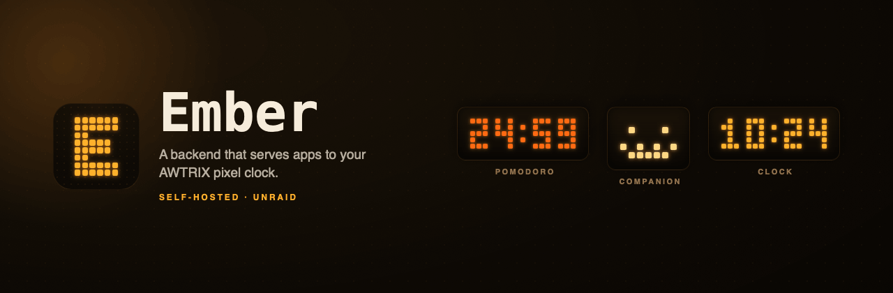

# Ember

Small status aggregator for showing Claude/Codex activity on an awtrix-ng clock.

The service is intentionally light:

- one Go binary, stdlib only
- single AWTRIX HTTP transport (no MQTT — see [`STYLE.md`](docs/STYLE.md) §11)
- bearer-token auth on write endpoints
- HTTP input endpoint for laptop-side producers

## Current Target

A single awtrix-ng clock on the local network (configure yours in `config.json`):

- AWTRIX HTTP URL: `http://<awtrix-ip>` (or let mDNS/UDP discovery find it — see
  [`RUNBOOK.md`](docs/RUNBOOK.md) → "Discovery & mDNS")
- Firmware: [awtrix-ng](https://github.com/Blueforcer/awtrix-ng) (`boardType:
  "awtrixng"` on `GET /api/v1/device`)

## Hardware & firmware

Ember drives a clock running [awtrix-ng](https://github.com/Blueforcer/awtrix-ng) —
Blueforcer's open-source firmware for the [Ulanzi](https://www.ulanzi.com) TC001
"Smart Pixel Clock" (or a self-built 32×8 matrix). Ember talks to it over the
firmware's HTTP API; see the [awtrix-ng docs](https://blueforcer.github.io/awtrix-ng/)
for flashing and the API reference. See [`RUNBOOK.md`](docs/RUNBOOK.md) →
"awtrix-ng flashing, backup, and first-boot" for moving a TC001 over from AWTRIX3.

Ember is an independent project, not affiliated with or endorsed by Ulanzi or the
AWTRIX firmware.

## Local Go

Built with the Homebrew Go toolchain:

```sh
go version
# go version go1.26.3 darwin/arm64
```

## Run Locally

```sh
cp config.example.json config.json
EMBER_TOKEN=dev-token go run ./cmd/ember -config config.json
```

Post a demo running status:

```sh
curl -X POST http://localhost:3627/v1/status \
  -H 'Authorization: Bearer dev-token' \
  -H 'Content-Type: application/json' \
  -d '{"source":"dt-mbp","tool":"codex","session":"awtrix","state":"running","message":"building"}'
```

Post a waiting approval:

```sh
curl -X POST http://localhost:3627/v1/status \
  -H 'Authorization: Bearer dev-token' \
  -H 'Content-Type: application/json' \
  -d '{"source":"dt-mbp","tool":"claude","session":"desktop","state":"waiting","message":"approve Bash"}'
```

Drop a single session:

```sh
curl -X DELETE http://localhost:3627/v1/status \
  -H 'Authorization: Bearer dev-token' \
  -H 'Content-Type: application/json' \
  -d '{"source":"dt-mbp","tool":"claude","session":"desktop"}'
```

Wipe everything (admin):

```sh
curl -X POST http://localhost:3627/v1/clear -H 'Authorization: Bearer dev-token'
```

Inspect current state (no auth):

```sh
curl http://localhost:3627/state | jq
```

## Protocol

The wire-protocol contract spec lives in the Obsidian vault (`Superpowers Specs/ember/`). Summary:

- Required fields: `source` (laptop ID), `tool` (`claude` | `codex` | …), `session`, `state` (`idle` | `running` | `waiting` | `done` | `error`).
- Producer emit policy: event on every transition, plus a 10s heartbeat while `running`/`waiting`.
- Server reaps idle sessions after `stale_seconds` (default 25s); `done`/`error` linger for `done_ttl_seconds` (default 30s).
- Write endpoints require `Authorization: Bearer <EMBER_TOKEN>`. Empty `EMBER_TOKEN` disables auth.
- Read endpoints (`GET /state`, `GET /healthz`) are always unauthenticated.

## Container image

The image is multi-stage and multi-arch (linux/amd64 + linux/arm64):
alpine builder → distroless `static-debian12:nonroot` runtime, ~7 MB,
runs as uid 65532, no shell.

**Build (single-arch dev):**
```sh
docker buildx build --platform linux/amd64 -t ember:dev --load .
```

**Build (multi-arch, intended target):**
```sh
docker buildx build --platform linux/amd64,linux/arm64 \
  -t ember:0.1.0 .
```
(no `--load` because Docker can't multi-load locally; use `--push` once
a registry is wired up — Phase 2.)

**Run:**
```sh
docker run --rm -d --name ember \
  -p 3627:3627 \
  -e EMBER_TOKEN="$(cat ~/.config/ember/token)" \
  -v /path/to/config.json:/etc/ember/config.json:ro \
  ember:dev
```

**Operator commands:**
```sh
docker exec ember /ember version
docker exec ember /ember doctor                 # full diagnostic
docker exec ember /ember --print-config         # what's in effect, secrets redacted
docker exec ember /ember healthcheck && echo OK
docker logs ember

# Operator HTTP (read):
curl http://localhost:3627/version
curl -H "Authorization: Bearer $EMBER_TOKEN" http://localhost:3627/admin/doctor

# Operator HTTP (mutate): hot-reload config without restart.
# Edit your bind-mounted config.json, then:
curl -X POST -H "Authorization: Bearer $EMBER_TOKEN" \
  http://localhost:3627/admin/reload
```

The binary's `healthcheck` subcommand defaults to probing
`http://127.0.0.1:3627/healthz`. If you bind the server to a non-default
port via `config.json`, set `EMBER_HEALTHCHECK_URL` to match.

The `doctor` subcommand defaults to `http://127.0.0.1:3627/admin/doctor`.
Override with `--server-url`. Use `--offline` for pre-flight checks before
starting the server.

**TLS (optional):** set both `EMBER_TLS_CERT_FILE` and `EMBER_TLS_KEY_FILE`
in the container environment to enable HTTPS. Setting only one is a
startup error; setting neither keeps the server on plain HTTP. The cert is
loaded once at startup — rotation requires a container restart. For a
self-signed homelab cert, issue it with `subjectAltName=IP:127.0.0.1` so
the in-image healthcheck can validate the loopback target. Two helper
env vars exist for the in-image healthcheck client:

- `EMBER_HEALTHCHECK_CA_FILE` — path to a PEM bundle to add to the trust
  pool (e.g. your homelab CA).
- `EMBER_HEALTHCHECK_INSECURE=1` — skip TLS verification entirely. Fine
  on a trusted LAN; the recommended easy path for self-signed setups.

The runtime image runs as UID 65532 (distroless `nonroot`). A cert mounted
read-only as `0600 root:root` will fail to read. Either `chmod 0644` the
files, `chown 65532` them, or drop them into a volume that the runtime
can read. Example:

```sh
docker run --rm -d --name ember \
  -p 8443:3627 \
  -e EMBER_TOKEN="$(cat ~/.config/ember/token)" \
  -e EMBER_TLS_CERT_FILE=/certs/cert.pem \
  -e EMBER_TLS_KEY_FILE=/certs/key.pem \
  -e EMBER_HEALTHCHECK_INSECURE=1 \
  -v /path/to/config.json:/etc/ember/config.json:ro \
  -v /path/to/certs:/certs:ro \
  ember:dev
```

`/admin/doctor`'s `http_listening` detail reflects the live scheme
(`scheme=https` when TLS is on, `scheme=http` otherwise).

**Prometheus `/metrics`:** the server always exposes `GET /metrics` on
the public mux (no auth, never rate-limited). The body is Prometheus
text exposition format:

- counters: `ember_requests_total{pattern,status}`,
  `ember_publish_total{result}`, `ember_publish_retries_total`,
  `ember_rate_limit_denied_total`, `ember_sessions_evicted_total`
- gauges: `ember_sessions_active`, `ember_uptime_seconds`,
  `ember_last_publish_unix`, `ember_last_publish_ok`,
  `ember_ratelimit_buckets`, `ember_build_info{revision,go_version}`

Cardinality is bounded — request counts are labelled by Go 1.22's
matched route pattern, not by URL path, so a 404 spammer can't blow up
series. Requests rejected by `requireAuth` / `adminRequireAuth` count
against the outer prefix (`/v1/`, `/admin/`) rather than the specific
route. The endpoint deliberately doesn't export Go runtime metrics
(goroutines, GC) — that would require `prometheus/client_golang`,
which we skip in line with the stdlib-only choice.

`/metrics` is unauthenticated and exposes the binary's git revision plus
Go version. That is fine for the trusted-LAN deployment this service
targets; if you bridge it to anything wider, terminate `/metrics` behind
a reverse proxy that adds auth.

Scrape config snippet (Prometheus):

```yaml
- job_name: ember
  scrape_interval: 15s
  static_configs:
    - targets: ['homelab.lan:3627']
```

**Rate limiting:** the server enforces a per-source-IP token-bucket
rate limit on `/v1/*` writes. Defaults: 60-token burst, 5 tokens/sec
sustained refill per IP, 5-minute idle-bucket eviction. The burst is
sized for one Mac's whole fan-out — menu-app polling plus a producer
per session, all sharing a source IP — reconnecting at once after a
network stall. `/admin/*` is rate-limited too, deliberately: it
authenticates with the same token, so its 401s must consume budget or
an attacker throttled on `/v1/*` could probe the token at full speed
there instead. Read endpoints (`/healthz`, `/state`, `/version`,
`/metrics`, the previews) are not rate-limited.
Tune via the `rate_limit` section of `config.json`
and reload with `POST /admin/reload`. To disable entirely, set
`rate_limit.disabled: true`. Note that `scripts/image-smoke.sh`
does not exercise `/v1/*` writes, so it does not validate the
rate-limit code path — that is covered by unit tests instead.

**Smoke test (requires Docker):**
```sh
./scripts/image-smoke.sh
```
The script skips with a friendly message when Docker is missing.

## Unraid install

The repo ships a personal Community Applications template at
[`deploy/unraid/ember.xml`](deploy/unraid/ember.xml). It is
pre-filled for a homelab with an AWTRIX device on the local LAN.

### One-time Docker Hub setup (do this BEFORE adding the container to Unraid)

The image is published to Docker Hub at `dtarakanov/ember` and is public.
No visibility toggle is needed. After your first `v*.*.*` tag push triggers
CI and the image lands on Docker Hub, you can proceed directly to the
install steps below.

### One-time install

1. In the Unraid web UI: **Docker → Add Container → Template URL** and
   paste:
   ```
   https://raw.githubusercontent.com/tarakanof/ember/main/deploy/unraid/ember.xml
   ```
   The form populates with defaults. Don't click Apply yet.

2. From your Unraid host shell (Terminal plugin or SSH), stage the
   appdata folder:
   ```sh
   mkdir -p /mnt/user/appdata/ember
   curl -fsSL -o /mnt/user/appdata/ember/config.json \
     https://raw.githubusercontent.com/tarakanof/ember/main/config.example.json
   vi /mnt/user/appdata/ember/config.json   # set awtrix.http_base_url
   ```
   (`vi` is universal on Unraid; use `nano` if you have the plugin.)

3. Back in the template UI: generate a bearer token (`openssl rand -hex
   32` from any shell) and paste into the `EMBER_TOKEN` field. Click
   **Apply**.

### Verify after first start

The runtime image is distroless: there is no shell inside the container,
so the Unraid Docker UI's **Console** icon will fail. Run diagnostics
from the Unraid host shell instead:

```sh
docker exec ember /ember doctor
```

(Replace `ember` with whatever name you gave the container in
the template UI — the template defaults the Name to `ember`,
but Unraid lets you override it.)

Every check should show `[OK]`. If `awtrix_reachable` fails, your
`awtrix.http_base_url` in `/etc/ember/config.json` is wrong
or the device is offline. Edit the file on the Unraid host
(`/mnt/user/appdata/ember/config.json`) and run:

```sh
curl -X POST -H "Authorization: Bearer <EMBER_TOKEN>" \
  http://<unraid-ip>:3627/admin/reload
```

to pick up the change without restarting the container.

### Upgrade

When a new release is published (any `v*.*.*` git tag triggers CI to
push a new image to Docker Hub), click **Force Update** on the container in
the Unraid Docker UI. The new image pulls; the container restarts;
in-flight requests drain on stop.

To pin a specific version, edit the template's **Repository** field
to `dtarakanov/ember:0.1.0` instead of `:latest`,
and Apply.

### Uninstall

Stop and Remove the container from the Unraid Docker UI. The appdata
folder at `/mnt/user/appdata/ember/` is preserved; remove
it manually (`rm -rf`) if you want a clean wipe. Pulled images stay
in Unraid's local Docker store until pruned via the Docker UI's
"Container Size" → cleanup flow. Old images on Docker Hub persist
indefinitely; delete unwanted versions via Docker Hub repository settings
if you care about hygiene.

### Producers (laptops)

The container is the *server* half. Producers (your Mac menu-bar
app and any `ember-claude-producer` cron) run on operator
laptops and POST to `http://<unraid-ip>:3627/v1/status` with the
bearer token. See:

- `macos/` — native macOS menu-bar app (Ember.app, built with Xcode)
- `cmd/ember-claude-producer/` — claude-code session producer

Both honour `EMBER_SERVER_URL` and `EMBER_TOKEN` env vars; configure
them to point at your Unraid IP and the same token you set above.

## Config

```json
{
  "http": { "addr": ":3627" },
  "awtrix": {
    "http_base_url": "http://<awtrix-ip>",
    "app_name": "ember",
    "timeout_seconds": 5
  },
  "auth": { "status_token_env": "EMBER_TOKEN" },
  "rate_limit": {
    "disabled": false,
    "burst": 60,
    "refill_per_sec": 5,
    "idle_evict_seconds": 300
  },
  "display": {
    "idle_text": "AI idle",
    "stale_seconds": 25,
    "done_ttl_seconds": 30,
    "heartbeat_seconds": 10,
    "refresh_seconds": 5,
    "notify_on_waiting": false
  }
}
```

## Pomodoro timer

An optional Pomodoro focus timer runs inside the same service/container. It is a
top-priority display: while a timer is active it takes over the matrix (a
graphics-first tomato/break pictogram, MM:SS countdown, and a remaining-time
progress bar) and the device buttons drive it; when idle it shows nothing and
the clock + AI-status behave normally.

Enable it in `config.json`:

```json
"pomodoro": {
  "enabled": true,
  "focus_minutes": 25,
  "short_break_minutes": 5,
  "long_break_minutes": 15,
  "rounds_before_long_break": 4,
  "auto_start_next": false,
  "sound": true,
  "sound_melody": "",
  "focus_color": "#FF3B30",
  "break_color": "#2EE85E",
  "db_path": "/var/lib/ember/pomodoro.db",
  "button_callback": true
}
```

Durations/colours/toggles are also editable at runtime from the macOS menu app's
settings window — a **Pomodoro tab** alongside the Status tab (and the menu's
Pomodoro section has Start / Pause / Resume / Skip / Stop plus today's stats;
"Pomodoro Settings…" opens that tab). Runtime edits persist in the SQLite DB
and survive restarts. Stats (completed pomodoros, focus minutes, streak,
per-day history) accumulate in `db_path` — mount a writable volume there in
Docker (the image ships `/var/lib/ember` as a `VOLUME`).

### Endpoints

```text
# Control (bearer auth):
POST /v1/pomodoro/start            # {"phase":"focus"} (phase optional)
POST /v1/pomodoro/{pause,resume,stop,skip}
GET  /v1/pomodoro/config
PUT  /v1/pomodoro/config

# Read (no auth):
GET  /v1/pomodoro/state
GET  /v1/pomodoro/stats

# Device button callback (no auth — the device cannot send a token):
POST /hooks/awtrix/button          # form: button=left|middle|right&state=1|0
```

### Device buttons

To control the timer with the TC001's physical buttons, point the device's
`buttonCallback` (`PUT /api/v1/system`) at this service so it POSTs each press
to `POST http://<service-host>:3627/hooks/awtrix/button` — the menu app's
Device tab can set this with one click (`PUT /v1/device/buttons`), or see
[`RUNBOOK.md`](docs/RUNBOOK.md) → "Device button → Pomodoro control" to do it
by hand. Mapping (on press-down): **middle = pause/resume/start**, **right =
skip phase**, **left = stop** (the old AWTRIX3 left+right chord is gone).
While a timer runs the service sets `blockNavigation:true` +
`autoTransition:false` on the device so the buttons drive the timer instead of
switching apps, and restores both when it stops.

The stock TC001 piezo buzzer plays the phase-end chime as RTTTL; set
`sound_melody` to a melody filename on the device, or leave it blank for the
built-in chime.
